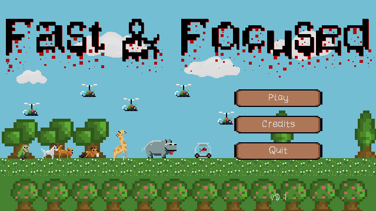
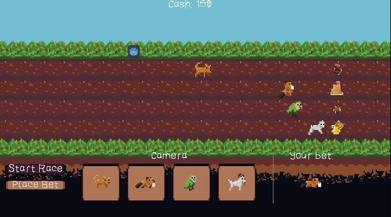
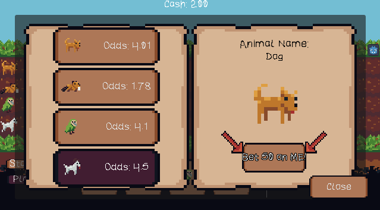
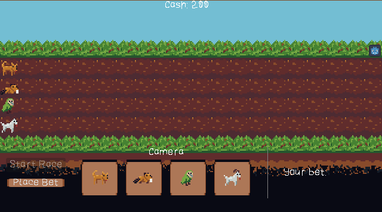

# FastAndFocused
Fast &amp; Focused is a morally challenging 2D racing game. Game was created for RatJam 2025.

## Game description

Autistic Animal Race Association is on its last leg and is on the edge of filing bankruptcy and is forced to slowly sell off all of their animals thus digging itself deeper and deeper. The only way to save as much of the animals as possible, you need to make some real money and quick. Fortunately, the betting markets are still in full swing and open for business.

The animals are not at all normal, they have their own, … ehm, personalities. So their response to some certain things may differ, so keep that in mind when placing your bets. Will you save some animals? become filthy rich or lose it all on red? The race track awaits.

### Controls

Keyboard
- Mouse for	UI interaction
- Switch camera by 1, 2, 3, 4
- Shout by spacebar

### Prerequisites

Software what you need is:

* [Godot 4 (4.4.1 or better)](https://godotengine.org/)
* [Visual Code (optional)](https://code.visualstudio.com/Download)

That's all :)

## Used Assets

- Used font: Awexbmp (https://nimblebeastscollective.itch.io/nb-pixel-font-bundle)

## Author

* **Jan Mesarč** - *Programmer, Game Design* - [LinkTree](https://linktr.ee/jan.mesarc)
* **Lukáš Stříž** - *Game Design, QA*
* **Matěj Gargula** - *Programmer, Art*
* **Petra Kropáčková** - *Art*
* **Tomáš Plhák** - *Game Design, Programmer*

## Screenshots

